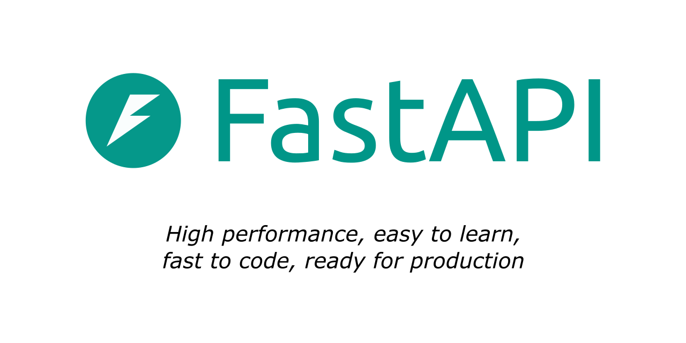

---
search:
  exclude: true
---

# 开发 - Docs 开发文档

这些是团队成员编辑docs时查看的文档。

包含了mkdocs的一些常用的语法使用的方式，本docs使用的是mkdocs框架的material主题

感谢`mkdocs-material`的开发人员，提供这么棒的一个主题

!!! tip
    此部分仅对少数人有用，即具有管理存储库权限的团队成员。你可以跳过它。😉
    以下语法主要内容来源于 [mkdocs-material的官方文档](https://squidfunk.github.io/mkdocs-material/)

---

## markdown 语法

### 标题等级

```markdown
#
##
###
####
#####
```

相当于html的`h1``h2`之类的
一般的都支持到`h6`:六级标题的程度，不过那样在页面展现的目录就很拥挤了，所以本项目最多每个md文件使用到四级标题

### 加粗

=== "效果"
    **你好**
    
=== "源码"
    ```markdown
    **你好**
    ```
注意本文档中加粗标识符与其他字符之间要有一个空格

如:前 **加粗文本** 后

### 链接


=== "效果"
    [教程 - 用户指南](https://fc.bxzdyg.cn/tutorial '这是学习fastapi-channel好手册')
    
=== "源码"
    ```markdown
    [教程 - 用户指南](https://fc.bxzdyg.cn/tutorial '这是学习fastapi-channel好手册')
    ```
===! "效果"
    [教程 - 用户指南](../tutorial/index.md '这是学习fastapi-channel好手册')
    
=== "源码"
    ```markdown
    [教程 - 用户指南](../tutorial/index.md '这是学习fastapi-channel好手册')
    ```

```markdown
[标题](地址<url或者相对路径> '提示')
```
### 图像

和链接很相似,多个`!`而已

===! "效果"
    
=== "源码"
    ```markdown
    
    ```

### 代码块
单个 ++grave++ ：反单引号（数字1的左边，注意是半角字符状态，才能打出） 的嵌套就可以对一个词汇进行标注。

=== "效果"
    `word`
    
=== "源码"
    ```markdown
    `word`
    ```

三个 ++grave++ ：反单引号 的嵌套就可以形成一个代码块区域。
在第一个代码块
使用代码块会让代码语言会被高亮和样式化处理，不过前提是你的程序有对应样式解析

===! "效果"
    ```python
    def add(a:int,b:int)->int:
        return a+b

    if __name__ == '__main__':
        print(add(1,2))
    ```
    
=== "源码"
    ````markdown
    ```python
    def add(a:int,b:int)->int:
        return a+b

    if __name__ == '__main__':
        print(add(1,2))
    ```
    ````
如果想要额外表示这一整个代码，就使用四个 ++grave++ 甚至更多的反单引号嵌套原来的代码块

`````
````markdown
```python
def add(a:int,b:int)->int:
    return a+b

if __name__ == '__main__':
    print(add(1,2))
```
````
`````

#### 表格

===! "效果"
    
    | emoji                     | desc |
    |---------------------------|------|
    | 🖐🏻🦶🏻🈚❌               | 手足无措 | 
    | 🙅🏻‍♀️⚪1️⃣0️⃣0️⃣0️⃣0️⃣🍐 | 不远万里 | 

=== "源码"
    ``` markdown
    | emoji                     | desc |
    |---------------------------|------|
    | 🖐🏻🦶🏻🈚❌               | 手足无措 | 
    | 🙅🏻‍♀️⚪1️⃣0️⃣0️⃣0️⃣0️⃣🍐 | 不远万里 | 
    ```

#### 水平分割线

===! "效果"
    ---
=== "源码"
    ```markdown
    ---
    
    ```

#### 注释
```markdown
[//]: # ()
[//]: # (**被注释内容**)
```

## mkdocs-material的格式

```markdown title="高亮显示的文本"
- ==This was marked (highlight)==
- ^^This was inserted (underline)^^
- ~~This was deleted (strikethrough)~~
```

- ==This was marked (highlight)==
- ^^This was inserted (underline)^^
- ~~This was deleted (strikethrough)~~

```markdown title="键盘按键"
++ctrl+alt+del++
```

++ctrl+alt+del++

其他的按键[映射文档](https://facelessuser.github.io/pymdown-extensions/extensions/keys/#extendingmodifying-key-map-index "有对应的html使用方式"){.internal-link target=_blank}

其他的基础样式不过多赘述,详见<a href="https://squidfunk.github.io/mkdocs-material/reference/formatting/" class="external-link" target="_blank">mkdocs-material的文档</a>

## tooltips

像是markdown语法中链接的扩展，不是链接的东西，直接使用文本也可以让它有一个小提示

[更多用法](https://squidfunk.github.io/mkdocs-material/reference/tooltips/){.internal-link target=_blank}

``` markdown title="带有 tooltip 的链接, 内联写法"
[Hover me](https://example.com "I'm a tooltip!")
```

<div class="result" markdown>

[Hover me](https://example.com "I'm a tooltip!")

</div>

## 代码块

直接使用代码块，mkdocs-material提供了一些功能：代码行高亮，文件名指定，段落数字

=== "效果"
    ```python title="main.py" hl_lines="1 3-5" linenums="1"
    def add(a:int,b:int)->int:
        return a+b

    if __name__ == '__main__':
        print(add(1,2))
    ```
=== "源码"
    ````markdown
    ```python title="main.py" hl_lines="1 3-5" linenums="1"
    def add(a:int,b:int)->int:
        return a+b

    if __name__ == '__main__':
        print(add(1,2))
    ```
    ````

## 告诫块

### ```!!!```和```???```
这两个都是告诫块的的语法，区别在于使用```???```就是可以折叠的，而默认是折叠状态，通常你可以使用```???+```一个`+`来保持默认的打开状态

=== "效果"
    ???+ note
        这是一个告诫块
=== "源码"
    ```markdown
    ???+ note
        这是一个告诫块
    ```

===! "效果"
    !!! note "笔记"
        这是一个告诫块
=== "源码"
    ```markdown
    !!! note "笔记"
        这是一个告诫块
    ```
在后面可以添加`"title"`来改变显示的标题

### 支持的类型

以下是 Material 为 MkDocs 提供的类型限定符列表，而默认类型是 note , 就是你输入一个不知名的类型或者不输入类型，响应的是note类型的警告块,
也可以[自定义类型](https://squidfunk.github.io/mkdocs-material/reference/admonitions/#custom-admonitions)

=== "效果"
    !!! note
        这是一个告诫块
=== "源码"
    ```markdown
    !!! note
        这是一个告诫块
    ```

===! "效果"
    !!! abstract
        这是一个告诫块
=== "源码"
    ```markdown
    !!! abstract
        这是一个告诫块
    ```

===! "效果"
    !!! info
        这是一个告诫块
=== "源码"
    ```markdown
    !!! info
        这是一个告诫块
    ```

===! "效果"
    !!! tip
        这是一个告诫块
=== "源码"
    ```markdown
    !!! tip
        这是一个告诫块
    ```

===! "效果"
    !!! success
        这是一个告诫块
=== "源码"
    ```markdown
    !!! success
        这是一个告诫块
    ```

===! "效果"
    !!! question
        这是一个告诫块
=== "源码"
    ```markdown
    !!! question
        这是一个告诫块
    ```

===! "效果"
    !!! warning
        这是一个告诫块
=== "源码"
    ```markdown
    !!! warning
        这是一个告诫块
    ```

===! "效果"
    !!! failure
        这是一个告诫块
=== "源码"
    ```markdown
    !!! failure
        这是一个告诫块
    ```

===! "效果"
    !!! danger
        这是一个告诫块
=== "源码"
    ```markdown
    !!! danger
        这是一个告诫块
    ```

===! "效果"
    !!! bug
        这是一个告诫块
=== "源码"
    ```markdown
    !!! bug
        这是一个告诫块
    ```


===! "效果"
    !!! example
        这是一个告诫块
=== "源码"
    ```markdown
    !!! example
        这是一个告诫块
    ```

===! "效果"
    !!! quote
        这是一个告诫块
=== "源码"
    ```markdown
    !!! quote
        这是一个告诫块
    ```
## 选项卡


=== "效果"
    ??? quote
        这是一个告诫块
=== "源码"
    ```markdown
    ??? quote
        这是一个告诫块
    ```
````markdown
=== "效果"
    ??? quote
        这是一个告诫块
=== "源码"
    ```markdown
    ??? quote
        这是一个告诫块
    ```
````

在同一级标题下多个不同的选项卡，在第二个的时候要在 `===` 后面添加 `!`,否则会和前面的合并在一起，变成子栏目

## mdx_include

作用引入某个文件指定段落的内容

优点是：是将文档之间代码块和文档分离，可以减少重复的文本，并且方便进行代码测试

> 项目地址：https://github.com/neurobin/mdx_include

现在有这么一个代码块，我把它放在项目中`docs_src/resources/docs_dev.py`这个位置

??? note
    ```python
    from typing import Optional
    
    from pydantic import BaseModel
    
    
    class Person(BaseModel):
        name: str
        age: Optional[int] = None
        email: str
        hobby: list[str]
    
        def introduce_me(self) -> None:
            print("hello!😀")
            print(f"i am {self.name}, {f'{self.age} years old this year' if self.age else '''I won't tell you my age'''}")
            print(f"my email is {self.email}")
            print(f"my hobby: {', '.join(self.hobby)}")
    
    
    if __name__ == "__main__":
        my = Person(
            name="BXZDYG",
            age=None,
            email="banxingzhedeyangguang@gmail.com",
            hobby=["code", "draw", "sleep", "game"],
        )
        my.introduce_me()

    ```

现在我想要使用mdx_include通过相对路径去引用它其中的片段

===! "效果"
    ```python
    {!> ../../docs_src/resources/docs_dev.py [ln:1,3,6-16]!}
    
    ```
=== "源码"
    ````
    ```python
    {!> ../../docs_src/resources/docs_dev.py [ln:1,3,6-16]!}
    
    ```
    ````

| Slice          | Details                    |
|----------------|----------------------------|
 | `[ln:1-4]`     | 从第一行到第四行                   |
 | `[ln:1.2-3.4]` | 第一行第2个字符到第三行第4个字符          |
 | `[ln:2-]`      | 从第二行到末尾                    |
 | `[ln:-3]`      | 最后一行到第三行（段落反转）             |
 | `[ln:6-2]`     | 第六行至第二行（段落反转）              |
| `[ln:2.9-2.2]` | 从第二行第9个字符到第二行的第2个字符（字符串反转） |
| `[ln:.3-.10]`  | 从每一行开始沿列进行切片，从第3个字符到第10个字符 |
| `[ln:2]`       | 仅限第行                       |
| `[ln:e]`       | 最后一行                       |

说实话这里`{!>`的`!`表示缩进我真没有什么特别的感觉，加了和去掉的效果并不明显，不过为了统一使用形式还是都加上`!`

## html
一些根据 **mkdocs-material** 样式的固定html句子式子

### external-link :material-information-outline:{ title="仅需修改href 和 BoBoBlog(innerText)的部分" }
===! "效果"
    <a href="https://fc.bxzdyg.cn" class="external-link" target="_blank">BoBoBlog</a>
=== "源码"
    ```markdown
    <a href="https://fc.bxzdyg.cn" class="external-link" target="_blank">BoBoBlog</a>
    ```

### markdown result :material-information-outline:{ title="可忽略" }

===! "效果"
    ``` markdown title="带有 tooltip 的链接, 内联写法"
    [Hover me](https://example.com "I'm a tooltip!")
    ```
    
    <div class="result" markdown>
    
    [Hover me](https://example.com "I'm a tooltip!")
    
    </div>
=== "源码"
    ````
    ``` markdown title="带有 tooltip 的链接, 内联写法"
    [Hover me](https://example.com "I'm a tooltip!")
    ```
    
    <div class="result" markdown>
    
    [Hover me](https://example.com "I'm a tooltip!")
    
    </div>
    ````

和代码块块靠近会形成一个卡片的样式，会把相关的代码和描述整合在一起，更好看些。

不过大部分语法并不支持放在这里，如：按键、tooltips、高亮显示标记、水平分割线，想用的话还是得先试试

还是有很多东西没有提及，不过我相信在开发中你会学习到的。